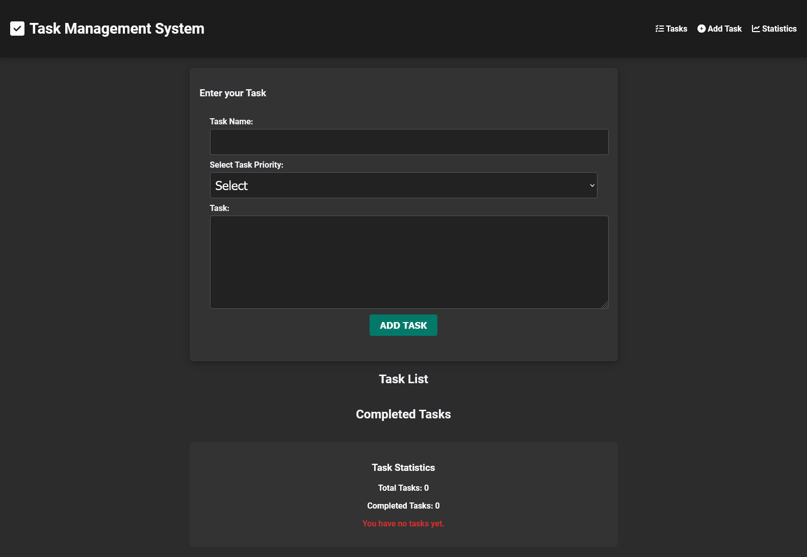

# Task Management System

A simple, responsive task management web application built using HTML, CSS, and JavaScript with features like adding, deleting, and completing tasks. It also categorizes tasks based on priority and moves completed tasks into a separate section.

## Features

- **Add Tasks:** Add tasks with a name, description, and priority level (High, Medium, Low).
- **Task Priority:** Tasks are sorted based on priority, with high-priority tasks displayed at the top.
- **Mark as Completed:** Tasks can be marked as completed, which moves them to a separate "Completed Tasks" section.
- **Delete Tasks:** Delete tasks you no longer need.
- **LocalStorage:** All tasks are saved to your browser’s local storage, allowing them to persist between sessions.
- **Responsive Design:** The layout adjusts based on screen size for a better user experience on mobile and desktop devices.
- **Animated Info Box:** The initial info message slowly disappears with a cool animation.

## Getting Started

### Prerequisites

All you need is a modern web browser to view and interact with the project.

### Installation

1. Clone the repository or download the source code:

    ```bash
    git clone https://github.com/Abhijith-AK/Task-Management-web.git
    ```

2. Navigate to the project folder:

    ```bash
    cd task-management-system
    ```

3. Open `index.html` in your browser to view the application.

### File Structure

task-management-system/  
│  
├── index.html         # Main HTML file  
├── mystyle.css        # Styles for the app  
├── myscript.js        # Main JavaScript for task management  
└── README.md          # This file  


## Usage

1. **Add Tasks:** Enter the task name, select priority, and provide a description, then click "ADD TASK".
2. **Delete Tasks:** Click on the "Delete" button next to a task to remove it.
3. **Mark as Completed:** Click on the "Mark as Completed" button to move the task to the "Completed Tasks" section.
4. **Task List Sorting:** Tasks are automatically sorted by priority, with higher priority tasks appearing at the top.

### Keyboard Shortcuts
- **Enter**: Add Task

## Responsive Design

The app is designed to work on all screen sizes, from large desktops to small mobile devices. The layout adjusts to ensure a smooth experience no matter the screen size.

### Screenshots

*Mobile View:*


*Desktop View:*



## Contributing

If you'd like to contribute, feel free to fork the repository and submit a pull request. Suggestions, improvements, and new features are welcome!

## License

This project is licensed under the MIT License - see the [LICENSE](LICENSE) file for details.

## Contact

If you have any questions or feedback, feel free to reach out to me on [LinkedIn](www.linkedin.com/in/abhijith-krishna-a-k).

